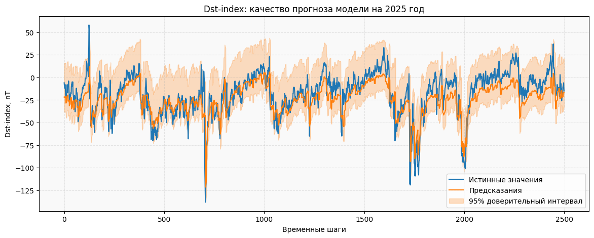

# Magnesis
> 🌎 Прогнозирование геомагнитных индексов Dst и AE на основе временных рядов параметров солнечного ветра для предсказания магнитных бурь и авроральной активности

### Данные
- OMNI dataset (NASA): https://spdf.gsfc.nasa.gov/pub/data/omni/
- Описание датасета: [dataset_doc.txt](data/dataset_doc.txt)

### Прогнозируемые индексы

- **Dst** — индекс кольцевого тока (характеризует геомагнитные бури)
- **AE** — индекс авроральной активности

### 🚀 Пример использования
```python
import pandas as pd
import matplotlib.pyplot as plt
from magnesis import GeomagneticNet

# загрузка модели
model = GeomagneticNet(model_dir="./weights", device="cpu")

# загрузка данных
geomagnesis_data = pd.read_csv("../data/datasets/test_2025.csv")

# прогноз / валидация
result = model.validate(geomagnesis_data, batch_size=32)

# визуализация результатов
result.plot()
```
> [Пример использования](notebooks/usage_example.ipynb)

Результат:


📌 TODO
* Документация API
* Описание валидной структуры данных для модели
* Улучшение визуализации результатов
