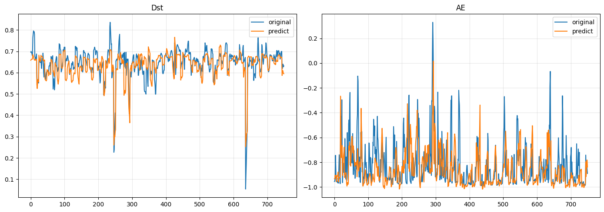

# Forecasting-of-earth-s-geomagnetic-activity
> 🌎 Прогнозирование магнитной активности земли
* [Данные](https://spdf.gsfc.nasa.gov/pub/data/omni/)
* [Описание датасета](data/dataset_doc.txt)

```
'Dst' — индекс кольцевого тока (магнитные бури)
'AE' — индекс авроральной активности
```




TODO docs
